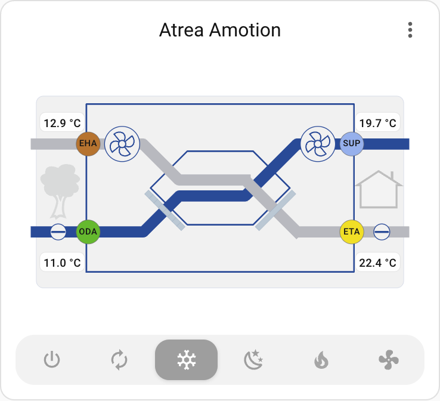
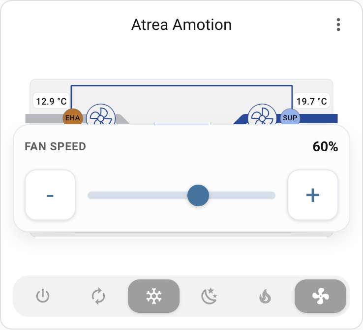
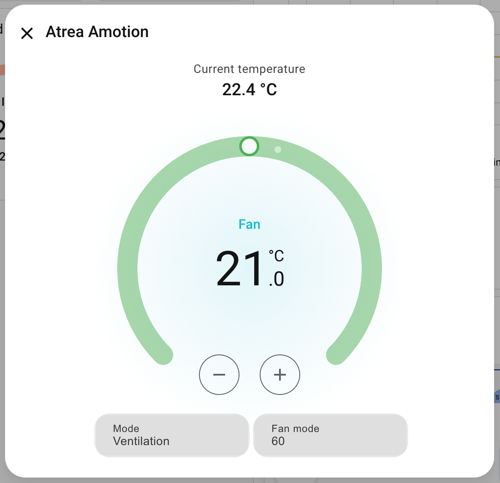

# Atrea aMotion Card

`custom:atrea-amotion-card` is a Home Assistant Lovelace custom card for Atrea aMotion heat recovery ventilation units. It renders the unit as an SVG schematic with animated fans, bypass routing, damper positions, temperatures, filters, and operating mode controls.

The card works best together with the dedicated custom Home Assistant integration for Atrea aMotion HRV units: [alexelite/atrea_amotion](https://github.com/alexelite/atrea_amotion).

## Features

- HACS-compatible frontend plugin
- TypeScript + Lit implementation
- inline SVG with responsive layout
- distinct main path vs bypass visualization
- animated supply and extract fans based on live speed sensors
- damper and filter state indicators
- more-info tap actions on key visual elements
- graceful degradation when optional entities are missing

## Screenshots

Main card view:



Fan popup:



More-info dialog:



## Recommended Integration

For the best experience, pair this card with the custom Atrea aMotion integration for Home Assistant:

- Repository: [alexelite/atrea_amotion](https://github.com/alexelite/atrea_amotion)
- Purpose: dedicated Home Assistant integration for Atrea aMotion HRV and ERV units
- Why it fits this card well: it exposes Atrea-specific entities and control surfaces that map naturally to the schematic card

The upstream integration README describes it as an Atrea aMotion integration for Home Assistant and notes that it extends control beyond a climate-only approach with additional platforms such as fan. This matches the way this card consumes both climate attributes and optional fallback entities. Source: [alexelite/atrea_amotion](https://github.com/alexelite/atrea_amotion).

## Installation

### HACS

1. Add this repository as a custom frontend repository in HACS.
2. Install `Atrea aMotion Card`.
3. HACS serves the built file from `dist/atrea-amotion-card.js`. Add the resource below if your Home Assistant version does not do it automatically:

```yaml
url: /hacsfiles/atrea-amotion-card/atrea-amotion-card.js
type: module
```

### Manual

1. Run `npm ci`
2. Run `npm run build`
3. Copy `dist/atrea-amotion-card.js` to `/config/www/atrea-amotion-card.js`
4. Add the Lovelace resource:

```yaml
url: /local/atrea-amotion-card.js
type: module
```

## Card Configuration

```yaml
type: custom:atrea-amotion-card
title: Atrea aMotion
show_title: true
theme_variant: auto
climate_entity: climate.atrea_amotion
bypass_select: select.atrea_bypass_mode
filter_reset_button: button.atrea_confirm_filter_replacement

entities:
  temperatures:
    oda: sensor.atrea_oda_temperature
    eta: sensor.atrea_eta_temperature
    sup: sensor.atrea_sup_temperature
    eha: sensor.atrea_eha_temperature

  fans:
    supply_speed: sensor.atrea_supply_fan_speed
    extract_speed: sensor.atrea_extract_fan_speed
  dampers:
    bypass: sensor.atrea_bypass_position

layout:
  compact: false
  show_airflow: false
  show_power: false
  show_filter_details: true
  fan_animation_max_rpm: 1800
```

## Climate Contract

`climate_entity` is the primary source of data and control for the card.

In the recommended setup, this is the custom `climate` entity exposed by the custom Home Assistant integration [alexelite/atrea_amotion](https://github.com/alexelite/atrea_amotion).

Recommended climate attributes:

- `outside_air_temperature`
- `extract_air_temperature`
- `supply_air_temperature`
- `exhaust_air_temperature`
- `supply_fan_speed_percent`
- `extract_fan_speed_percent`
- `bypass_position_percent`
- `oda_damper_percent`
- `eta_damper_percent`
- `current_mode`
- `filter_days_remaining`
- `warning`
- `fault`

Optional climate attributes:

- `supply_airflow`
- `extract_airflow`
- `supply_power`
- `extract_power`
- `temperature_unit`
- `airflow_unit`
- `power_unit`
- `preset_modes`
- `fan_modes`

The card reads `climate_entity` first and falls back to `entities.*` only when a required attribute is missing.

## Required Configuration

- `climate_entity`

## Optional Entities

- `bypass_select`
- `filter_reset_button`
- fallback `entities.temperatures.*`
- fallback `entities.fans.*`
- fallback `entities.dampers.*`
- fallback `entities.filters.*`
- fallback `entities.mode.*`
- fallback `entities.alerts.*`

## Behavior Notes

- Numeric damper entities are read as percentages.
- Textual or binary damper states normalize `open/on/true` to `100%` and `closed/off/false` to `0%`.
- When bypass is open, the bypass path is visually highlighted over the main heat recovery route.
- When `climate_entity` exposes `preset_modes`, the card calls `climate.set_preset_mode`.
- When `climate_entity` exposes `fan_modes`, the card calls `climate.set_fan_mode`.
- Legacy `entities.mode.select` still works as a fallback and uses `select.select_option`.
- With `prefers-reduced-motion`, fan and flow animations are disabled.

## Development

```bash
npm ci
npm run typecheck
npm run test
npm run build
```

## Preview Assets

- Example dashboard config: [demo/example-config.yaml](demo/example-config.yaml)
- Screenshot checklist: [demo/screenshot-reference.md](demo/screenshot-reference.md)
